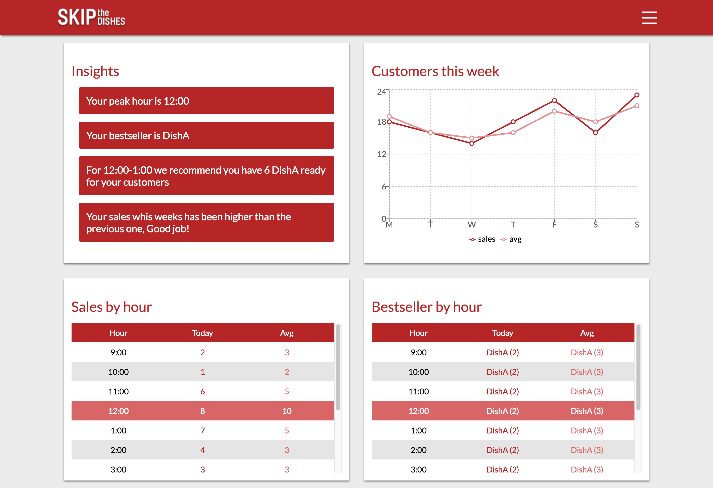
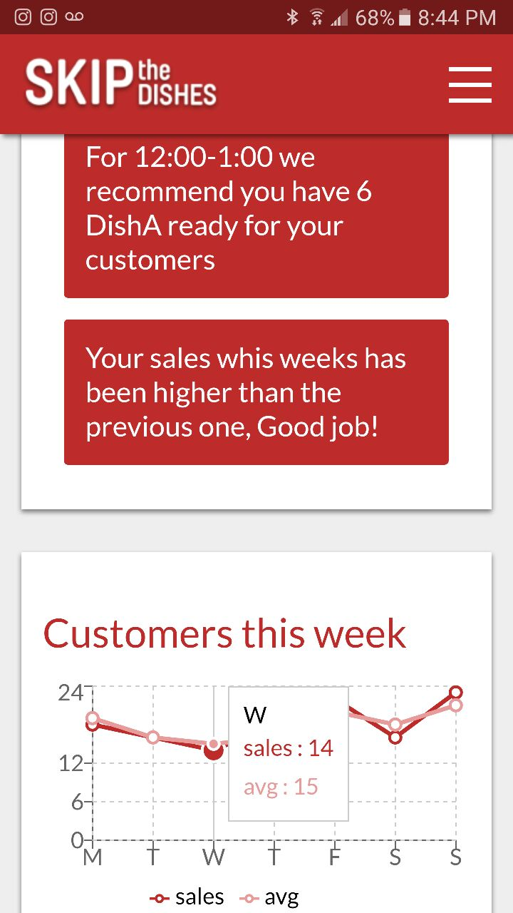
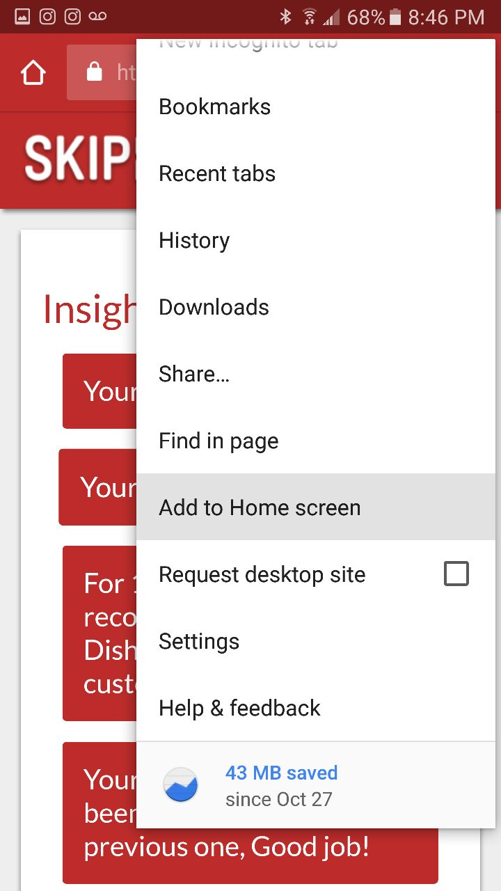

# Skip The Dishes Coding Challenge

Site is Avalaible at https://irvingv8.github.io/skipthedishes/



## Intro

After researching a little bit about Skip The Dishes I noticed that you have
three types of users: Consumer, Couriers, Partners/Restaurants.

I decided to focus on the Restaurants, this app is intended to give them some
nice presented stats about how their business are performing in Skip The Dishes.

The solution is a PWA build with React, Redux and Styled Components.

The whole structure of the project is based on
[Atomic Design](http://atomicdesign.bradfrost.com/chapter-1/).

## Considerations

* The app is a PWA but the service working hasn't been implemented to allow
  offline storage.
* The app is just the front end, no API has been developed for it due to time
  constrains.
* The data being presented is just static data inside /src/data/index.js and a
  timeout has been added to the redux actions to simulate data fetching.
* The data being used already has the proper structure to be used in the
  application, however in the real world the data might need to be
  manipulated/transformed after fetching it.

## Q/A

Q: Why a PWA ?

A: I've been wanting to build one forever
([And this talk from Addy Osmani just made it worse](https://www.youtube.com/watch?v=aCMbSyngXB4))

Q: Why Atomic Desgin ?

A: I've been wanting to try atomic design for a while, as I once build a mid
sized react application (it was my first application indeed) and the folder
structure started to get messy as the project grow. This was my first try at
atomic design and I really enjoyed the way it made my components more cleaner

Q: Why Styled Components ?

A: Using CSSinJS allows for encapsulation out of the box, without the need of
dealing with complicated naming conventions. Also Atomic Design and Styled
Components are a perfect match.

Q: How do I run this locally?

A: Clone/Download this repo and:

```
npm install
npm start
```

or

```
yarn install
yarn start
```

---

## The stack involved:

* React
* React-Dom
* Styled-Components
* Recharts
* Redux
* React-Redux
* Redux-Thunk

---

## Screenshots




